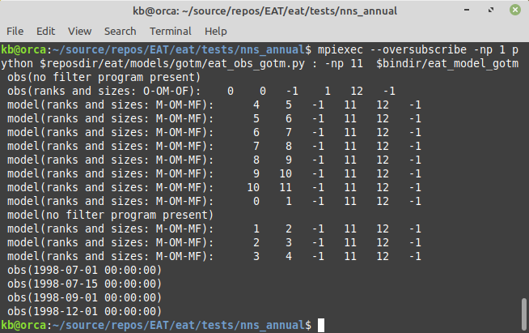

## Using EAT with GOTM as model.

The present default CMake configuration includes support for using [GOTM](https://www.gotm.net) as the dynamical model. GOTM v6 is included as a submodule for EAT and the GOTM code is automatically cloned as part of the clone of the EAT code (note - this might change in the future but for now considered the most convenient way to get a working system). 

In connection with EAT using GOTM as the dynamical model the standard GOTM test case *nns_annual* (Northern North Sea annual configuration) is adopted and included in *..../tests/nns_annual* folder.

The case is identical to the standard case except an ensemble of 11 members has been generated by creating 11 different gotm.yaml configuration files. They only differ in the scale\_factor for u10 and v10. The YAML-configuration naming convention is *gotm_????.yaml* where ???? is constructed from the ensemble member number. 

## Ensemble simulation.

EAT provides an easy method for generating and ensemble of model simulations - also in the case where there is no data-assimilation. 

The following command must be executed in the GOTM case folder. 

`mpiexec --oversubscribe -np 11 $bindir/eat-gotm`

The result will be:

## Ensemble simulation with time periods provided by observation program.

The simulation can be split in time chunks according to times provided in the file *obs_times.dat* like:

The simulation start and stop time are given in the YAML-configuration file. The date/times from *obs_times.dat* is used to split the simulation in shorter parts.

`mpiexec --oversubscribe -np 1 python $reposdir/eat/models/gotm/eat_obs_gotm.py : -np 5 $bindir/eat-gotm`

Each ensemble member will create a log file - as a normal GOTM simulation does. The naming of the log files follows the scheme of the GOTM-yaml files.

As a new feature - the observation times are indicated in the log files as:

## Full assimilation simulation

To run the full assimilation scheme with EAT the following command is used:

`mpiexec --oversubscribe -np 1 python $reposdir/eat/models/gotm/eat_obs_gotm.py : -np 1 $bindir/eat_filter_pdaf : -np 11  $bindir/eat-gotm`

A total of 13 processes will be started.
